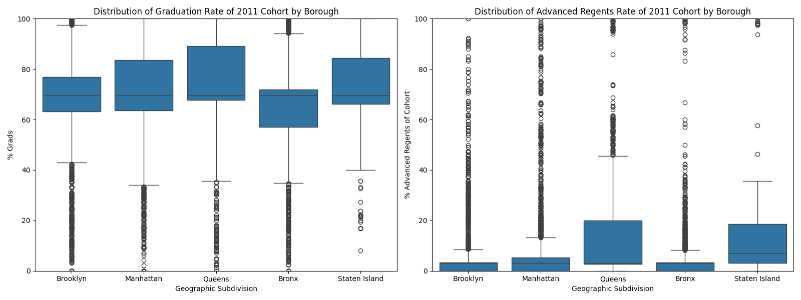
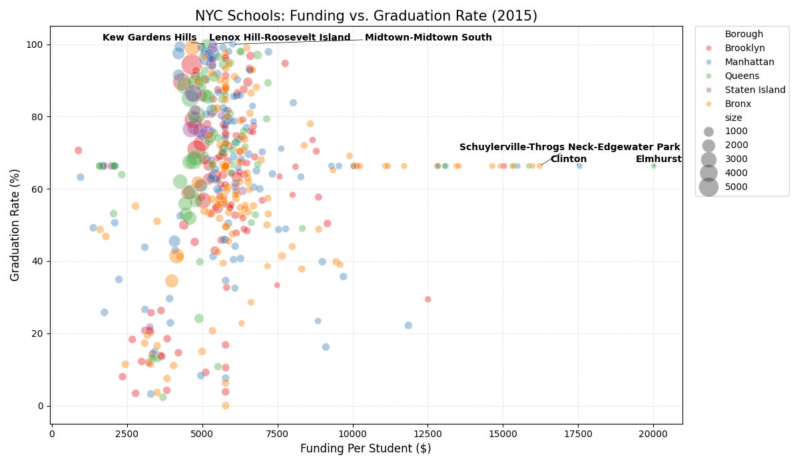
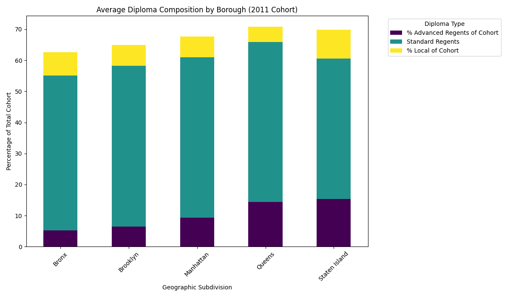
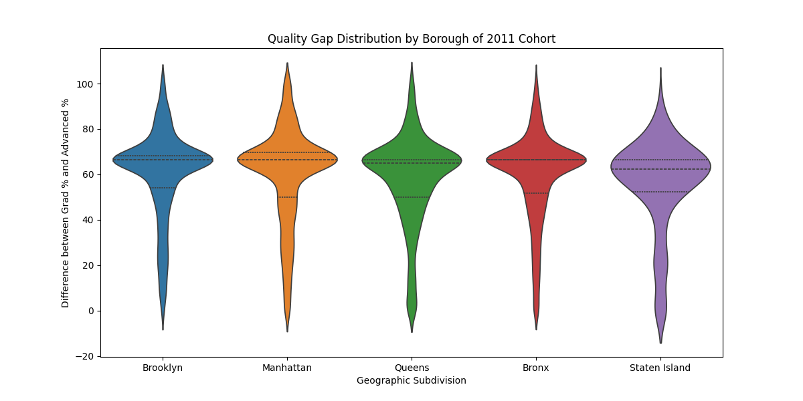
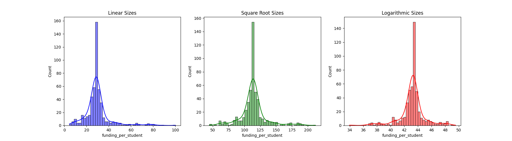
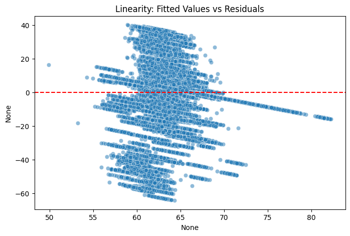
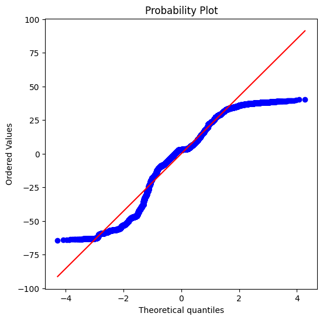

---
execute:
  eval: false
jupyter: python3
format:
  pdf: default
  html:
    code-fold: true
---

# NYC Transit Complexity : A look at the relation between transit complexity and school graduation rates

## Introduction
The relationship between urban infrastructure and educational outcomes is critical to how we view social mobility. In a city as large and complex as New York, the ability of a student to navigate the transit system efficiently can dictates their access to education, opportunities, and attendance. This study investigates the Commuter Complexity Index (CCI), a metric designed to quantify the difficulty of transit navigation and its correlation with high school graduation rates across the five boroughs. By integrating transit network graphs with school performance data from the 2014-2015 academic year, we aim to identify whether transit complexity serves as a barrier to academic success

## Dataset
The research synthesizes over nine distinct datasets, primarily sourced from NYC Open Data, covering the 2014-2015 period.

**Data Range** : 2014-2015

1. General Transit Feed Specification (GTFS) Data
    - 2015 Subway GTFS File
        - transfers : `from_stop_id`, `to_stop_id`, `min_transfer_time`
        - stop_times : `trip_id`, `arrival_time`, `departure_time`, `stop_id`
        - stops : `stop_id`, `stop_name`, `stop_lat`, `stop_lon`
    - 2015 Bus GTFS files
        - Bronx, Brooklyn, Manhattan, Mtabc, Queens, Staten Island
        - stop_times : `trip_id`, `arrival_time`, `departure_time`, `stop_id`
        - stops : `stop_id`, `stop_name`, `stop_lat`, `stop`
2. Graduation Results Cohorts
    - `Report Category`, `Category`, `Cohort Year`, `Cohort`, `Geographic Subdivision`, `% Grads`, `% Advanced Regents of Cohort`
3. School Budget Overview 2014-2015
    - `Location`, `S4: Label d: FY14 FSF Initial`
3. DOE High School Directory 2014-2015
    - `dbn`, `total_students`
4. School Locations 2014-2015
    - `LOCATION_CODE`, `LOCATION_NAME`, `lon`, `lat`, `LOCATION_TYPE_DESCRIPTION`, `NTA_NAME`, `LOCATION_CATEGORY_DESCRIPTION`
5. Demographic Profiles of American Community Survey (ACS) 5 Year Estimates at the NNTA level  2012-2016
    - demographic, economic, house, social
    - `GeoID`, `GeogName`, `Borough`
    - `PBwPvP`, `MdHHIncE`, `CvLFUEm2P`, `Pop15t19P`, `GRPI35plP`, `EA_BchDHP`, `LgOEnLEP1P`
6. NYC Borough Boundaries 2026
    - GEOjson file
7. NYC Walk Graph 2026
    - sourced from OSMnx
8. NYC Neighborhood Tabulation Areas (NTA) Data 2010
    - Shapefile files

## Data Processing
This section details the pipeline for transforming raw public transit, educational, and demographic data into a structured network model. The process is divided into three parts, Transit Graph Construction, Educational Performance Filtering, and Neighborhood Socioeconomic Mapping.

### GTFS Data Processing
The transit processing module converts raw General Transit Feed Specification (GTFS) files into a weighted directed graph representing the NYC transit network.

- **Temporal Filtering & Standardization**: To model the commute relevant to students, the dataset is restricted to weekdays between 07:00 and 10:00. All clock-face timestamps are converted to total seconds from midnight to allow for mathematical operations on travel duration.

- **Edge Weight Calculation**: Travel time between stops (u and v) is calculated as
    $$Weight=Arrival\_Time_v​−Departure\_Time_u​$$
    - Weights are aggregated by taking the mean travel time across all qualifying trips to account for frequency variations.

- **Transfer Logic**: Recognizing that subway navigation involves walking between platforms, the model incorporates a transfers.txt analysis.
    - Minimum Transfer: Set to 60 seconds to prevent "instant" transitions.
    - Average Transfer: Defaulted to 180 seconds where specific data is missing, representing typical walking and wait times within stations.


- **Data Unification**: All nodes (stops) and edges (travel segments) are assigned a system-specific prefix (e.g., sub_, bus_bx_) to prevent ID collisions when merging the subway and various borough-based bus networks into a single "master" graph


```{python}
def process_gtfs_data(gtfs_dir, prefix):
    # process stops
    stops_df = pd.read_csv(os.path.join(gtfs_dir, "stops.txt"))
    stops_df = stops_df[['stop_id', 'stop_name', 'stop_lat', 'stop_lon']].copy()
    stops_df['stop_id'] = prefix + "_"+ stops_df['stop_id'].astype(str)
    stops_df['mode'] = 'subway' if 'sub' in prefix else 'bus'

    # process shapes and trips
    shapes_df = pd.read_csv(os.path.join(gtfs_dir, "shapes.txt"))
    shapes_df['shape_id'] = prefix + "_" + shapes_df['shape_id'].astype(str)

    trips_df = pd.read_csv(os.path.join(gtfs_dir, "trips.txt"))
    trips_to_shapes = trips_df.set_index('trip_id')['shape_id'].to_dict()

    # process edges (travel time)
    st_df = pd.read_csv(os.path.join(gtfs_dir, "stop_times.txt"))

    ## filter for weekdays and school time
    st_df = st_df[st_df['trip_id'].str.contains('Weekday|Wkd', case=False, na=False)].copy()
    st_df = st_df[(st_df['arrival_time'] >= "07:00:00") & (st_df['arrival_time'] <= "10:00:00")]
    st_df = st_df.sort_values(by=['trip_id', 'stop_sequence'])

    print(prefix)
    print(st_df.empty)

    edges = []
    for trip_id, group in st_df.groupby('trip_id'):
        shape_id = trips_to_shapes.get(trip_id)
        rows = group.to_dict('records')

        for i in range(len(rows) - 1):
            u, v = rows[i], rows[i+1]
            weight = to_seconds(v['arrival_time']) - to_seconds(u['departure_time'])
            if weight > 0:
                edges.append({
                    'source': f"{prefix}_{u['stop_id']}",
                    'target': f"{prefix}_{v['stop_id']}",
                    'weight': weight,
                    'type': 'transit_travel',
                    'shape_id': f"{prefix}_{shape_id}"
                })
    
    
    edges_df = pd.DataFrame(edges)
    edges_df = edges_df.groupby(['source', 'target', 'type', 'shape_id'], as_index=False)['weight'].mean()

    # process transfers for subway
    transfer_file = os.path.join(gtfs_dir, "transfers.txt")
    avg_transfer_time = 180
    min_transfer_time = 60

    if os.path.exists(transfer_file):
        trans_df = pd.read_csv(transfer_file)
        trans_list = []
        for _, row in trans_df.iterrows():
            time = row.get('min_transfer_time', None)
            if pd.isna(time) : time = avg_transfer_time
            elif time <= 0 : time = min_transfer_time

            trans_list.append({
                'source': f"{prefix}_{row['from_stop_id']}",
                'target': f"{prefix}_{row['to_stop_id']}",
                'weight': time,
                'type': 'sub_transfer',
                'shape_id': None
            })
        trans_df = pd.DataFrame(trans_list)
        edges_df = pd.concat([edges_df, trans_df])

    return stops_df, edges_df, shapes_df
```

<br>

### School Data Processing

**Geospatial Alignment**: School coordinates are normalized to the EPSG:4326 coordinate system. The dataset is strictly filtered to include only "High School" and "K-12 all grades" categories.

**Feature Engineering**:

- Financials: Integrates the FSF Initial budget figures to determine resource allocation.
- Demographics: Links student population sizes, allowing for the calculation of funding per student.
- Performance: Merges 4-year graduation cohorts and Advanced Regents diploma rates to serve as proxies for academic quality.


**Missing Data**: To maintain a robust sample size for the network, missing values for size, budget, and graduation rates are imputed using median values.

```{python}
def process_schools(input_paths, output_path):
    print("Processing school csvs")
    sch_df = pd.read_csv(input_paths[0])
    
    coords = sch_df.apply(convert_coords, axis=1)
    sch_df = pd.concat([sch_df, coords], axis=1)
    sch_df = sch_df.dropna(subset=['lon', 'lat'])

    output_cols = [
        'LOCATION_CODE', 'LOCATION_NAME', 'lon', 'lat', 
        'LOCATION_TYPE_DESCRIPTION', 'NTA_NAME', 'LOCATION_CATEGORY_DESCRIPTION'
    ]
    clean_df = sch_df[output_cols].copy()
    #print(clean_df['LOCATION_CATEGORY_DESCRIPTION'].value_counts())

    # filter for High schools and K-12
    clean_df = clean_df[(clean_df['LOCATION_CATEGORY_DESCRIPTION']  == 'High school') | 
                        (clean_df['LOCATION_CATEGORY_DESCRIPTION']  == 'K-12 all grades')]
    clean_df = clean_df.drop(columns=['LOCATION_CATEGORY_DESCRIPTION'])
    clean_df['NTA_NAME'] = clean_df['NTA_NAME'].str.strip()
    print("after HS filter", str(clean_df.notna().all(axis=1).sum()))

    clean_df_key = 'LOCATION_CODE'

    # process school funding
    sch_fund = pd.read_csv(input_paths[2])
    sch_fund[clean_df_key] = sch_fund['Location']
    sch_fund['budget'] = (
        sch_fund['S4: Label d: FY14 FSF Initial']
        .replace(r'[$,]', '', regex=True)
        .astype(float)
    )
    fund_subset = sch_fund[[clean_df_key, 'budget']].copy()
    clean_df = pd.merge(
        fund_subset, clean_df, on=clean_df_key, how="outer")
    print("after funding addition" , str(clean_df.notna().all(axis=1).sum()))

    # process school population
    sch_pop = pd.read_csv(input_paths[1])
    sch_pop[clean_df_key] = sch_pop['dbn'].astype(str).str[-4:]
    sch_pop['total_students'] = pd.to_numeric(
        sch_pop['total_students'].str.replace(r'[^\d-]', '', regex=True),
        errors='coerce'
    )
    pop_subset = sch_pop[[clean_df_key, 'total_students']].copy()
    pop_subset.rename(columns={'total_students': 'size'}, inplace=True)
    clean_df = pd.merge(
        pop_subset, clean_df, on=clean_df_key, how="outer")
    print("after population addition" , str(clean_df.notna().all(axis=1).sum()))

    # process school grad_results
    grad_df = pd.read_csv(input_paths[3], low_memory=False)
    grad_df = grad_df[
        (grad_df['Report Category'].isin(['School', 'Charter School'])) &
        (grad_df['Category'] == 'All Students') &
        (grad_df['Cohort Year'] == 2011) &
        (grad_df['Cohort'] == '4 year June')
    ]
    grad_df[clean_df_key] = grad_df['Geographic Subdivision'].astype(str).str[-4:]
    grad_df['% Grads'] = pd.to_numeric(grad_df['% Grads'], errors='coerce')
    grad_df['% Advanced Regents of Cohort'] = pd.to_numeric(grad_df['% Advanced Regents of Cohort'], errors='coerce')
    grad_subset = grad_df[[clean_df_key, '% Grads', '% Advanced Regents of Cohort']].copy()
    grad_subset.rename(columns={'% Grads': 'grad_rate', '% Advanced Regents of Cohort': 'adv_regents_rate'}, inplace=True)
    clean_df = pd.merge(
        clean_df, grad_subset, on=clean_df_key, how="outer"
    )
    print('after grad results', clean_df.notna().all(axis=1).sum())

    # drop cols based on shape_point df
    clean_df.dropna(subset=['LOCATION_NAME'], inplace=True)
    print('after dropping on location_name', clean_df.notna().all(axis=1).sum())

    # look at missing data
    print('number of nan rows', clean_df.isna().any(axis=1).sum())
    missing_schools = clean_df[clean_df.isna().any(axis=1)]['LOCATION_CODE']
    missing_schools = pd.merge(clean_df, missing_schools, on=clean_df_key, how="right")
    missing_schools.to_csv('missing_school_15.csv', index=False)
    # mostly full of k-12 and charter school
    print(clean_df.shape)

    # fill in missing data
    med_pop = clean_df['size'].median()
    clean_df['size'] = clean_df['size'].fillna(med_pop)
    med_fund = clean_df['budget'].median()
    clean_df['budget'] = clean_df['budget'].fillna(med_fund)
    med_grad = clean_df['grad_rate'].median()
    clean_df['grad_rate'] = clean_df['grad_rate'].fillna(med_grad)
    med_agrad = clean_df['adv_regents_rate'].median()
    clean_df['adv_regents_rate'] = clean_df['adv_regents_rate'].fillna(med_agrad)

    print('number of nan rows', clean_df.isna().any(axis=1).sum())

    # normalize/weight and fill in missing data
    clean_df['funding_per_student'] = clean_df['budget']/clean_df['size']
    clean_df['weighted_accessibility'] = clean_df['funding_per_student']*clean_df['grad_rate']
    clean_df['weighted_accessibility_adv'] = clean_df['funding_per_student']*clean_df['adv_regents_rate']

    clean_df.to_csv(output_path, index=False)
```


### ACS and Neighborhood Data Processing
To understand the socioeconomic context of the areas students are traveling from, American Community Survey (ACS) 5-year estimate data is processed at the Neighborhood Tabulation Area (NTA) level.

**Multi-Domain Integration**: Data is pulled from four distinct ACS tables to create a multidimensional view of NYC neighborhoods:

| Category | Key Metrics Extracted |
|:---------|:----------------------|
| Economic | Poverty rate, Median income, Unemployment rate |
| Demographic | Percentage of population aged 15–19 (Target Student Demographic) |
| Housing | Rent burden (households paying >35% of income on rent) |
| Social | Educational attainment (Bachelor's+), Limited English Proficiency |

- **Standardization**: All numeric features are cleaned of non-numeric characters and missing values are filled with NTA-wide medians to ensure the dataset is ready for correlation analysis with the transit accessibility results.

```{python}
def process_acs(output_path):
    print("Processing nta_acs csvs")

    files = {
        'dem' : "./data/other/acs_nta/demo_2016acs5yr_nta.csv",
        'econ' : "./data/other/acs_nta/econ_2016acs5yr_nta.csv",
        'hous' : "./data/other/acs_nta/hous_2016acs5yr_nta.csv",
        'soc' : "./data/other/acs_nta/soc_2016acs5yr_nta.csv"
    }

    cols = ['GeoID', 'GeogName', 'Borough']
    mappings = {
        'econ': {
            'PBwPvP': 'poverty_rate_pct',
            'MdHHIncE': 'median_income_estimate',
            'CvLFUEm2P': 'unemployment_rate_pct'
        },
        'dem': {
            'Pop15t19P': 'pop_15_to_19_pct'
        },
        'hous': {
            'GRPI35plP': 'rent_burdened_35plus_pct'
        },
        'soc': {
            'EA_BchDHP': 'bachelors_deg_or_higher_pct',
            'LgOEnLEP1P': 'limited_english_proficiency_pct'
        }
    }

    main_df = pd.read_csv(files['econ'])
    main_df = main_df[cols + list(mappings['econ'].keys())]
    
    main_df = main_df.rename(columns=mappings['econ'])
    for key in ['dem', 'hous', 'soc']:
        df = pd.read_csv(files[key])
        cols_nd = ['GeoID'] + [c for c in mappings[key].keys() if c in df.columns]
        df_subset = df[cols_nd].rename(columns=mappings[key])
        main_df = pd.merge(main_df, df_subset, on="GeoID", how='outer')

    # missing data
    missing_ntas = main_df[main_df.isna().any(axis=1)]['GeoID']
    missing_ntas = pd.merge(missing_ntas, main_df, on='GeoID', how='right')
    missing_ntas.to_csv('missing_ntas_15.csv', index=False)

    # fill in data
    numeric_cols = main_df.select_dtypes(include=np.number).columns
    print(numeric_cols)
    main_df[numeric_cols] = main_df[numeric_cols].fillna(main_df[numeric_cols].median())

    main_df.to_csv(output_path, index=False)
    print('number of nan rows', main_df.isna().any(axis=1).sum())
    print("ACS df shape:", main_df.shape)
    print("cols:", main_df.columns.to_list())
```

## Exploratory Analysis

```{python}
# grad results analysis
base_path = "data/"
grad_path = os.path.join(base_path,"raw/grad_results_1-15.csv")
grad_results = pd.read_csv(grad_path)
print(grad_results.columns)

# data cleaning
numeric_cols = [
    '# Total Cohort',              # size
    '% Grads',                     # success metric
    '% Advanced Regents of Cohort',# high 
    '% Total Regents of Cohort',   # standard
    '% Local of Cohort',           # safety-net
    '% Still Enrolled',            # potential future grads
    '% Dropout',                   # failure metric
    '% TASC (GED) of Cohort'       # alternative success
]

for cols in numeric_cols:
    grad_results[cols] = pd.to_numeric(grad_results[cols], errors='coerce')
    # s values are for suppressed data for student privacy 

    col_med = grad_results[cols].median()
    grad_results[cols] = grad_results[cols].fillna(col_med)

grad_results['advanced_gap'] = grad_results['% Grads'] - grad_results['% Advanced Regents of Cohort']

school_subgraph = grad_results[
    (grad_results['Report Category'] == "School") 
    | (grad_results['Report Category'] == "Charter School")
]

district_subgraph = grad_results[
    grad_results['Report Category'] == "District"
]
    
borough_subgraph = grad_results[
    grad_results['Report Category'] == 'Borough'
]

citywide_subgraph = grad_results[
    grad_results['Report Category'] == 'Citywide'
]

borough_map = {
    'K': 'Brooklyn',
    'X': 'Bronx',
    'M': 'Manhattan',
    'Q': 'Queens',
    'R': 'Staten Island'
}
borough = school_subgraph['Geographic Subdivision'].str[2].map(borough_map)
focused_schools = school_subgraph[school_subgraph['Cohort'] == '4 year August']
focused_schools = focused_schools[focused_schools['Cohort Year'] == 2011]
foc_borough = focused_schools['Geographic Subdivision'].str[2].map(borough_map)

# Dropout vs. Grad 
plt.figure(figsize=(10, 7))
sns.scatterplot(
    data=focused_schools, 
    x='% Still Enrolled', 
    y='% Dropout',
    hue=borough,
    alpha=0.6
)
plt.title('Persistence vs. Attrition : 2001-2015 Grad Results')
plt.savefig('grad_result_sch_RvsA.png')

# Quantity vs Quality Graph
plt.figure(figsize=(10, 8))
sns.scatterplot(
    data=school_subgraph, 
    x='% Grads', 
    y='% Advanced Regents of Cohort',
    #size= '# Total Cohort',
    alpha=0.5,
    hue=borough, # Color by Borough
)
plt.plot([0, 100], [0, 100], color='red', linestyle='--') 
plt.title('Quantity vs. Quality: 2001-2015 Grad Results')
plt.savefig('grad_result_sch_QvsQ.png')

# Grad vs Adv_Grad Box Plot Graph
fig, axes = plt.subplots(1, 2, figsize=(16, 6))


sns.boxplot(ax=axes[0], data=focused_schools, x=foc_borough, y='% Grads')
axes[0].set_title('Distribution of Graduation Rate of 2011 Cohort by Borough')
axes[0].set_ylim(0, 100)

sns.boxplot(ax=axes[1], data=focused_schools, x=foc_borough, y='% Advanced Regents of Cohort')
axes[1].set_title('Distribution of Advanced Regents Rate of 2011 Cohort by Borough')
axes[1].set_ylim(0, 100)

plt.tight_layout()
plt.savefig('bxplot_sch_bh.png')

# Advanced Gap Violin
plt.figure(figsize=(12, 6))
sns.violinplot(
    x=foc_borough, 
    y=focused_schools['advanced_gap'], 
    inner="quartile",
    hue=foc_borough,
    legend=False
)
plt.title('Quality Gap Distribution by Borough of 2011 Cohort')
plt.ylabel('Difference between Grad % and Advanced %')
plt.savefig('sch_advanced_gap_violin.png')

# School Type  Comparison
plt.figure(figsize=(12, 6))
sns.boxplot(
    data=school_subgraph, 
    x='Report Category', 
    y='% Grads', 
    hue='Report Category',
    legend=False
)
plt.title('Graduation Rates by School Type: 2001-2015 Grad Results')
plt.ylabel('% Graduates')
plt.savefig('sch_type_comp.png')

# Diploma Comparison Bar
composition = focused_schools.groupby(foc_borough)[[
    '% Advanced Regents of Cohort', 
    '% Total Regents of Cohort', 
    '% Local of Cohort'
]].mean()

composition['Standard Regents'] = composition['% Total Regents of Cohort'] - composition['% Advanced Regents of Cohort']
composition_plot = composition[['% Advanced Regents of Cohort', 'Standard Regents', '% Local of Cohort']]

composition_plot.plot(kind='bar', stacked=True, figsize=(12, 7), colormap='viridis')
plt.title('Average Diploma Composition by Borough (2011 Cohort)')
plt.ylabel('Percentage of Total Cohort')
plt.legend(title='Diploma Type', bbox_to_anchor=(1.05, 1), loc='upper left')
plt.xticks(rotation=45)
plt.tight_layout()
plt.savefig('diploma_composition_bar.png')
# %%
# processed schools analysis
school_df = pd.read_csv("processed_schools_2015.csv")

school_df['Borough'] = school_df['LOCATION_CODE'].str[0].map(borough_map)

## funding vs grad
plt.figure(figsize=(12, 7))
sns.scatterplot(
    data=school_df, 
    x='funding_per_student', 
    y='grad_rate', 
    size='size',        # Bubbles represent school size
    hue='Borough',      # Color by neighborhood to see clusters
    alpha=0.4,
    sizes=(40, 500),
    palette='Set1',
)

top_performers = pd.concat([
    school_df.nlargest(2, 'grad_rate'),
    school_df.nlargest(2, 'funding_per_student')
]).drop_duplicates(subset=['LOCATION_CODE'])

texts = []
top_performers = pd.concat([
    school_df.nlargest(3, 'grad_rate'),
    school_df.nlargest(3, 'funding_per_student')
]).drop_duplicates(subset=['LOCATION_CODE'])

for i, rw in top_performers.iterrows():
    texts.append(plt.text(
        rw['funding_per_student'], 
        rw['grad_rate'], 
        rw['NTA_NAME'], 
        fontsize=10, 
        weight='bold'
    ))

adjust_text(texts, arrowprops=dict(arrowstyle='->', color='black', lw=0.5))
plt.title('NYC Schools: Funding vs. Graduation Rate (2015)', fontsize=15)
plt.xlabel('Funding Per Student ($)', fontsize=12)
plt.ylabel('Graduation Rate (%)', fontsize=12)

plt.legend(bbox_to_anchor=(1.02, 1), loc='upper left',borderaxespad=0)
plt.grid(True, linestyle='--', alpha=0.3)
plt.tight_layout()
plt.savefig("fund_grad_bor.png")

## spatial performance
boroughs = gpd.read_file("./data/spatial/Borough_Boundaries.geojson").to_crs(epsg=4326)
schools_gdf = gpd.GeoDataFrame(
    school_df, 
    geometry=gpd.points_from_xy(school_df['lon'], school_df['lat']),
    crs="EPSG:4326"
)
fig, ax = plt.subplots(figsize=(14, 12))
boroughs.plot(ax=ax, color='#f2f2f2', edgecolor='black', linewidth=0.5, zorder=1)
sns.scatterplot(
    data=school_df,
    x='lon',
    y='lat',
    hue='adv_regents_rate',
    size='grad_rate',
    palette='viridis',
    sizes=(20, 400),
    alpha=0.4,
    edgecolor='white',
    linewidth=0.5,
    ax=ax,
    zorder=2
)

leg = ax.legend(
    bbox_to_anchor=(1.02, 1), 
    loc='upper left', 
    title="School Metrics",
    fontsize='medium',
)

ax.set_title('NYC School Performance Geography (2015)', fontsize=18, pad=20)
ax.set_aspect(1.3)
ax.axis('off')

plt.tight_layout()
plt.savefig("sch_perf.png")

## funding disparity
plt.figure(figsize=(12, 6))
other_categories = [
    'Special Education', 
    'Home School', 
    'Alternative' 
]
labels = [l for l in school_df['LOCATION_TYPE_DESCRIPTION'].unique() if l not in other_categories]
labels.append('Other/Specialized')

sns.violinplot(
    data=school_df, 
    x=school_df['LOCATION_TYPE_DESCRIPTION'].replace(other_categories, 'Other/Specialized'), 
    y=school_df['funding_per_student'], 
    inner="box", 
    hue=school_df['LOCATION_TYPE_DESCRIPTION'].replace(other_categories, 'Other/Specialized'),
    legend=False
)

plt.xticks(rotation=45)
plt.title('Distribution of Funding per Student by School Type')
plt.ylabel('Funding ($)')
plt.savefig("sch_type.png")
```

### School Performance and Demographics

#### Borough Variance


- most boroughs show median graduation rates hovering around 70%
- advanced regents rates are strikingly low compared to the % of grad as a whole
- advanced regents chart shows extreme positive skewness

#### Funding and Graduation


- concentration of schools in Manhattan (Blue) and Queens (Green) that achieve 80–100% graduation rates with funding $4,000~$6,000 per student
- past the $10,000 mark, schools in areas like Elmhurst and Clinton where funding spikes significantly, yet graduation rates remain stagnant or even lower
- Bronx points are vertically stacked arount 5k to 6k with 0% to 80% graduation rate
- larger bubbles (representing 3,000+ students) tend to cluster higher on the Y-axis
- many of the 90%+ graduation rate schools are mid-to-large sized, whereas the very small schools (tiny dots) are more scattered

#### School Composition


- Queens has the highest overall graduation rate and Staten Island has the largest purple segments
- the standard regents is fairly cconsistent across all boroughs 


- the widest area for most boroughs is between 60 and 80 suggests on average there is a 70-point gap between their total graduation rate and their advanced graduation rate



- log/sqrt transformation will likely yield a more stable R-squared and satisfy the assumption of homoscedasticity better than the raw values (skewed)


## Method
The core idea of this study is to calculate a commuter complexity index (CCI) to quantify the diffculty of navigating the NYC transit system for students

### Network Construction
A directed graph was constructed using the processed_shapes, processed_edges, and processed_stops .csv from the `gtfs_preprocessing.py`

- **Node** : represents unique transit stops, school, and nta centers
- **Edges** : Represent both physical transit segments (trips) and transfer opportunities between lines
- **Weight**s: Edges are weighted by travel time (in seconds), with a fixed minimum transfer time of 60 seconds and an average transfer time of 180 seconds.

```{python}
# %%
crs_code = 'EPSG:2263'
walk_spd = 4.5567 # feets/sec
ft_per_meter = 3.2808 # feet
max_dist =  985 # feet
min_weight = 10 # second
os.chdir(os.path.dirname(os.path.abspath(__file__)))

# %%

# create graph
walk_graph = ox.graph_from_place("New York City, New York", network_type='walk', simplify=True, retain_all=True)
walk_graph = ox.project_graph(walk_graph, to_crs=crs_code)
boroughs = gpd.read_file("./data/spatial/Borough_Boundaries.geojson").to_crs(crs_code)
nxG = nx.MultiDiGraph()

# rename nodes and add type to match rest of network
mapping = {n: f'walk_{n}' for n in walk_graph.nodes()}
walk_graph = nx.relabel_nodes(walk_graph, mapping, copy=False)
nx.set_node_attributes(walk_graph, "walk", name='type')

# convert edge weights to seconds
for u, v, k, data in walk_graph.edges(keys=True, data=True):
    len_meter = data.get('length', 0)
    len_feet = len_meter * ft_per_meter
    data['weight'] = max(len_feet / walk_spd, min_weight / 2)
    data['relation'] = 'walking'

# %%

transit_edges_df = pd.read_csv("processed_edges_2015.csv")
transit_stops_df = pd.read_csv("processed_stops_2015.csv")
transit_gdf = gpd.GeoDataFrame(
    transit_stops_df,
    geometry = gpd.points_from_xy(transit_stops_df['stop_lon'], transit_stops_df['stop_lat']),
    crs="EPSG:4326"
)
transit_gdf.to_crs(crs_code, inplace=True)

for idx, rw in transit_gdf.iterrows():
    nxG.add_node(
        rw['stop_id'], 
        x=rw.geometry.x,
        y=rw.geometry.y, 
        pos=(rw.geometry.x, rw.geometry.y),
        type=f"{rw['mode']}_transit"
    )
for idx, rw in transit_edges_df.iterrows():
    nxG.add_edge(
        rw['source'], 
        rw['target'], 
        weight=rw['weight'],
        relation=rw['type'] # 'transit_travel', 'sub_transfer'
    )

# %%
# connect walking network and transit network
nxG_final = nx.compose(walk_graph, nxG)

#tranit graph
transit_nodes = [n for n, d in nxG_final.nodes(data=True) if 'transit' in str(d.get('type'))]
t_x = np.array([nxG_final.nodes[n]['x'] for n in transit_nodes])
t_y = np.array([nxG_final.nodes[n]['y'] for n in transit_nodes])

new_edges = []
nearest_street_nodes = ox.distance.nearest_nodes(walk_graph, X=t_x, Y=t_y)

for i, t_node in enumerate(transit_nodes):
    s_node = nearest_street_nodes[i]
    
    # find distance
    x1, y1 = t_x[i], t_y[i]
    x2, y2 = walk_graph.nodes[s_node]['x'], walk_graph.nodes[s_node]['y']
    dist = euclidean_distance(x1, y1, x2, y2)

    if dist > max_dist: 
        print(f"Skipping stop {t_node} is {dist:.1f}ft from nearest street")
        continue

    weight = max(dist / walk_spd, min_weight)
    

    new_edges.append((t_node, s_node, {'weight': weight, 'relation': 'walk_transit'}))
    new_edges.append((s_node, t_node, {'weight': weight, 'relation': 'walk_transit'}))

nxG_final.add_edges_from(new_edges)

# %%
# check for unconnected transit stops
unconnected = [n for n in transit_nodes if nxG_final.degree(n) == 0]
print(f"Number of unconnected transit stops: {len(unconnected)}")

# check weights for walk_transit
weights = [d['weight'] for u, v, d in nxG_final.edges(data=True) if d['relation'] == 'walk_transit']
print(f"Min weight: {min(weights)}, Max weight: {max(weights)}")

# find specific edge with large weight
max_edge = max(nxG_final.edges(data=True), key=lambda x: x[2].get('weight', 0))
print(f"The longest edge is between {max_edge[0]} and {max_edge[1]}")
print(f"Relation: {max_edge[2].get('relation')}, Weight: {max_edge[2]['weight']}")

bad_node = nxG_final.nodes['bus_si_203833']
print(f"Coordinates of stop: {bad_node['y']}, {bad_node['x']}")

# %%
# add school nodes and walking edge to Graph
school_df = pd.read_csv("processed_schools_2015.csv")
school_gdf = gpd.GeoDataFrame(
    school_df,
    geometry=gpd.points_from_xy(school_df['lon'], school_df['lat']),
    crs="EPSG:4326"
).to_crs(crs_code)

sch_ids = [f"school_{code}" for code in school_df['LOCATION_CODE']]
sch_x = school_gdf.geometry.x.values
sch_y = school_gdf.geometry.y.values

for idx, rw in school_df.iterrows():
    sch_node = sch_ids[idx]
    nxG_final.add_node(
        sch_node, 
        x = sch_x[idx],
        y = sch_y[idx],
        pos= (sch_x[idx], sch_y[idx]), 
        name= rw['LOCATION_NAME'], 
        nta = rw['NTA_NAME'],
        sch_weight = rw['funding_per_student'], # (total funding/total students)
        type='school')

nearest_street_nodes = ox.distance.nearest_nodes(walk_graph, X=sch_x, Y=sch_y)

new_school_edges = []
for i, sch_node in enumerate(sch_ids):
    s_node = nearest_street_nodes[i]
    
    # Calculate Euclidean distance
    x1, y1 = sch_x[i], sch_y[i]
    x2, y2 = walk_graph.nodes[s_node]['x'], walk_graph.nodes[s_node]['y']
    dist = euclidean_distance(x1, y1, x2, y2)

    w = max(dist / walk_spd, min_weight)

    new_school_edges.append((sch_node, s_node, {'weight': w, 'relation': 'walk_school'}))
    new_school_edges.append((s_node, sch_node, {'weight': w, 'relation': 'walk_school'}))

nxG_final.add_edges_from(new_school_edges)
sch_weights = [d['weight'] for u, v, d in nxG_final.edges(data=True) if d['relation'] == 'walk_school']
print(f"Added {len(sch_ids)} schools and {len(new_school_edges)} connecting edges.")
print(f"Min weight: {min(sch_weights)}, Max weight: {max(sch_weights)}")
# %%
# add nta nodes and walking edge to Graph
nta_gdf = gpd.read_file("./data/spatial/nta_2010/nynta2010.shp").to_crs(crs_code)

#print("nta_shapefile cols:", nta_gdf.columns.tolist())

nta_df = pd.read_csv('nta_SE_indicators_2015.csv')
income_dict = nta_df.set_index('GeoID')['median_income_estimate'].to_dict()

rep_points = nta_gdf.geometry.representative_point()
nta_x = rep_points.x.values
nta_y = rep_points.y.values
nta_codes = nta_gdf['NTACode'].values

nearest_street_nodes = ox.distance.nearest_nodes(walk_graph, X=nta_x, Y=nta_y)
new_nta_edges = []

for i, rw in nta_gdf.iterrows():
    nta_code = nta_codes[i]
    nta_node = f"nta_{nta_code}"
    s_node = nearest_street_nodes[i]
    
    #coordinates & distance 
    x1, y1 = nta_x[i], nta_y[i]
    x2, y2 = walk_graph.nodes[s_node]['x'], walk_graph.nodes[s_node]['y']
    dist = euclidean_distance(x1, y1, x2, y2)

    # Add the Node
    nxG_final.add_node(
        nta_node,
        x = x1,
        y = y1,
        pos = (x1, y1),
        income = income_dict.get(nta_code),
        name = rw.get('NTAName', 'Unknown'),
        type = 'origin'
    )

    weight = max(dist / walk_spd, min_weight) 
    new_nta_edges.append((nta_node, s_node, {'weight': weight, 'relation': 'walk_nta'}))
    new_nta_edges.append((s_node, nta_node, {'weight': weight, 'relation': 'walk_nta'}))

nxG_final.add_edges_from(new_nta_edges)
nta_weights = [d['weight'] for u, v, d in nxG_final.edges(data=True) if d['relation'] == 'walk_nta']
print(f"Added {len(nta_codes)} NTAs and {len(new_nta_edges)} connecting edges")
print(f"Min weight: {min(nta_weights)}, Max weight: {max(nta_weights)}")

# %%
# building nodes and edge geometry list

## Filter the nodes into the different types so they can be represented differently on the visual
## subway_transit, bus_transit, walk, school, nta
nodes_data = []
for node, data in nxG_final.nodes(data=True):
    nodes_data.append({
        'stop_id': node, 
        'geometry': Point(data['x'], data['y']),
        'node_type': data.get('type')
        })

gdf_nodes = gpd.GeoDataFrame(nodes_data, crs=crs_code)

gdf_nodes = gpd.sjoin(gdf_nodes, boroughs[['geometry']], predicate='within')
valid_stops = set(gdf_nodes['stop_id'])

# Filter the edges into different types so they can be represented differently on the visual
# transit_travel, sub_transfer, walking, walk_transit, walk_school, walk_nta
shapes_df = pd.read_csv("processed_shapes_2015.csv")
shape_lookup = {name: group for name, group in shapes_df.groupby('shape_id')}

edges_data = []
for u, v, data in nxG_final.edges(data=True):
    if u in valid_stops and v in valid_stops:
        shape_id = data.get('shape_id')

        if shape_id and shape_id in shape_lookup:
            pts = shape_lookup[shape_id].sort_values('shape_pt_sequence')
            geom_4326 = LineString(zip(pts.shape_pt_lon, pts.shape_pt_lat))
            geom = gpd.GeoSeries([geom_4326], crs="EPSG:4326").to_crs(crs_code).iloc[0]
        else:
            u_pos = (nxG_final.nodes[u]['x'], nxG_final.nodes[u]['y'])
            v_pos = (nxG_final.nodes[v]['x'], nxG_final.nodes[v]['y'])
            geom = LineString([u_pos, v_pos])
        edges_data.append({
            'geometry' : geom,
            'travel_time' : data.get('weight'),
            'edge_type' : data.get('relation')
            })
gdf_edges = gpd.GeoDataFrame(edges_data, crs=crs_code)

min_tk = gdf_edges['travel_time'].min()
max_tk = gdf_edges['travel_time'].max()

print(f"Minimum Travel Time : {min_tk} and Maximum Travel Time : {max_tk}")
```

### Complexity Calculation
The CCI is derived by analyzing the "centrality" and "reachability" of schools within the transit graph

1. **Spatial Join**: Mapping schools to their nearest transit nodes using EPSG:4326 coordinates.
2. **Pathfinding**: Calculating the shortest paths between Neighborhood Tabulation Areas (NTAs) and school locations during school hours
3. **Normalization**: Adjusting raw complexity scores against socioeconomic indicators (from ACS 5-year estimates) to isolate the "transit effect" from poverty or income variables

$$ CCI = Time\_Spent\_Traveling + Transfer\_Penalty$$


- dense convergence of yellow (subway) and blue (bus) lines in Manhattan creates a centrality sink, lower CCI scores
- sparse coverage in parts of Eastern Queens and Southern Staten Island

```{python}
def calculate_CCI(nx_graph, apply_penalty=True):
    transfer_penalty = 180

    for u, v, k, data in nx_graph.edges(keys=True, data=True):
        base_time = data.get('weight', 0)
        penalty = 0
        
        if apply_penalty:
            rel = data.get('relation', '')
            if rel == 'walk_transit':
                penalty = transfer_penalty * 1.75
            elif rel == 'sub_transfer':
                penalty = transfer_penalty * 1.25
        
        data['tmp_w'] = base_time + penalty

    nta_nodes = [n for n, d in nx_graph.nodes(data=True) if d.get('type') == 'origin']
    school_nodes = {n for n, d in nx_graph.nodes(data=True) if d.get('type') == 'school'}

    results = {}
    for start_node in nta_nodes:
        if start_node not in nx_graph:
            results[start_node] = {s: np.nan for s in school_nodes}
            continue
        lengths = nx.single_source_dijkstra_path_length(nx_graph, start_node, weight='tmp_w')

        results[start_node] = {s: lengths.get(s, np.nan) for s in school_nodes}
        
    return results
        
def CCI_graph(results, prefix):
    flattened_data = []
    for origin, schools in results.items():
        for school, cost in schools.items():
            flattened_data.append({
                'origin_id': origin,
                'school_id': school,
                'cci_cost': cost
            })
    
    cci_df = pd.DataFrame(flattened_data)
    cci_df.to_csv(f"cci_result.csv", index=False)
    print(f"Results saved to cci_result.csv")

    cci_nx = nx.DiGraph()
    
    for entry in flattened_data:
        if not np.isnan(entry['cci_cost']):
            cci_nx.add_edge(
                entry['origin_id'], 
                entry['school_id'], 
                weight=entry['cci_cost']
            )
            
    with open(f"{prefix}_cci_result_graph.pkl", 'wb') as f:
        pickle.dump(cci_nx, f)
        
    return cci_nx
```


## Modeling Approach and Analyses

```{python}
# %%
sch_df = pd.read_csv('processed_schools_2015.csv')
nta_df = pd.read_csv('nta_SE_indicators_2015.csv')
cci_df = pd.read_csv('cci_result.csv')

if 'cci_cost' in cci_df.columns and 'CCI' not in cci_df.columns:
    cci_df = cci_df.rename(columns={'cci_cost': 'CCI'})
cci_df['school_id'] = cci_df['school_id'].str.replace('school_', '')
cci_df['origin_id'] = cci_df['origin_id'].str.replace('nta_', '')

main_df = pd.merge(cci_df, sch_df, left_on='school_id', right_on='LOCATION_CODE', how='inner')
main_df = pd.merge(main_df, nta_df, left_on='origin_id', right_on='GeoID', how='inner')

# Interaction term: Travel accessibility impact moderated by poverty
main_df['travel_poverty_interaction'] = main_df['CCI'] * main_df['poverty_rate_pct']

predictors = [
    'CCI', 'funding_per_student', 'poverty_rate_pct', 'median_income_estimate', 
    'unemployment_rate_pct', 'rent_burdened_35plus_pct', 'travel_poverty_interaction'
]
target = 'grad_rate'

# Drop missing values
main_df = main_df.dropna(subset=predictors + [target])

# %%
# train,test spilt & scale 
X_train_raw, X_test_raw, y_train, y_test = train_test_split(
    main_df[predictors], 
    main_df[target], 
    test_size=0.2, 
    random_state=42
)

scaler = StandardScaler()
X_train = pd.DataFrame(scaler.fit_transform(X_train_raw), columns=predictors, index=X_train_raw.index)
X_test = pd.DataFrame(scaler.transform(X_test_raw), columns=predictors, index=X_test_raw.index)
```

### OLS Regression and Statistical Diagonsitics
The baseline OLS model revealed a statistically significant relationship between the Commuter Complexity Index (CCI) and graduation rates
```
                            OLS Regression Results                            
==============================================================================
Dep. Variable:              grad_rate   R-squared:                       0.019
Model:                            OLS   Adj. R-squared:                  0.019
Method:                 Least Squares   F-statistic:                     206.6
Date:                Mon, 27 Apr 2026   Prob (F-statistic):          3.45e-305
Time:                        08:33:03   Log-Likelihood:            -3.3604e+05
No. Observations:               74575   AIC:                         6.721e+05
Df Residuals:                   74567   BIC:                         6.722e+05
Df Model:                           7                                         
Covariance Type:            nonrobust                                         
==============================================================================================
                                 coef    std err          t      P>|t|      [0.025      0.975]
----------------------------------------------------------------------------------------------
const                         63.3220      0.080    789.076      0.000      63.165      63.479
CCI                           -0.6543      0.156     -4.198      0.000      -0.960      -0.349
funding_per_student            3.0090      0.080     37.480      0.000       2.852       3.166
poverty_rate_pct              -1.4033      0.281     -4.991      0.000      -1.954      -0.852
median_income_estimate        -0.1583      0.142     -1.118      0.264      -0.436       0.119
unemployment_rate_pct         -0.1437      0.120     -1.193      0.233      -0.380       0.092
rent_burdened_35plus_pct      -0.0963      0.105     -0.920      0.358      -0.302       0.109
travel_poverty_interaction     1.7119      0.251      6.815      0.000       1.220       2.204
==============================================================================
```

- CCI coefficient of -0.6543 (p<0.001) indicates that as commute complexity increases, school graduation rates tend to decrease
- funding_per_student showed a strong positive correlation (3.0090), while poverty_rate_pct had a negative impact (-1.4033)
- $R^2$ of 0.019 indicates that while the predictors are statistically significant, they explain a small portion of the overall variance in graduation rates

```{python}
# OLS Model Base
X_train_ols = sm.add_constant(X_train)
ols_model = sm.OLS(y_train, X_train_ols).fit()

print("OLS Regression Summary (Training Set)")
print(ols_model.summary())
print("\n")
```

## Residual Analysis and Assumptions
```{python}
# Assumption 
residuals = ols_model.resid
fitted_values = ols_model.fittedvalues

# Linearity
plt.figure(figsize=(8, 5))
sns.scatterplot(x=fitted_values, y=residuals, alpha=0.5)
plt.axhline(0, color='red', linestyle='--')
plt.title("Linearity: Fitted Values vs Residuals")
plt.show()

# Homoscedasticity (Breusch-Pagan)
bp_test = het_breuschpagan(residuals, ols_model.model.exog)
print(f"=== Breusch-Pagan Test (p-value): {bp_test[1]:.4f} ===")

# Independence (VIF & Durbin-Watson)
vif_data = pd.DataFrame({
    "Feature": ols_model.model.exog_names,
    "VIF": [variance_inflation_factor(ols_model.model.exog, i) for i in range(ols_model.model.exog.shape[1])]
})
print("\n=== VIF Results ===\n", vif_data)
print(f"Durbin-Watson Score: {durbin_watson(residuals):.4f}")

# Normality (Q-Q Plot & Shapiro-Wilk)
plt.figure(figsize=(6, 6))
stats.probplot(residuals, dist="norm", plot=plt)
plt.show()
shapiro_p = stats.shapiro(residuals)[1]
print(f"=== Shapiro-Wilk Normality Test (p-value): {shapiro_p:.4f} ===")
```

### Linearity


- shows distinct horizontal banding, suggests model may strugge with discrete graduation values or there were missing a non-linear relationship 

### Normality


- shows significant deviations from the reference line at the tails, suggests that the residuals are not perfectly normal distributed and shows heavy tails

### Heteroscedasticity
A Breusch-Pagan test yielded a p-value of 0.0000, confirming the presence of heteroscedasticity

### Multicollinearity
```
                       Feature        VIF
0                       const   1.000000
1                         CCI   3.772057
2         funding_per_student   1.000847
3            poverty_rate_pct  12.277579
4      median_income_estimate   3.114109
5       unemployment_rate_pct   2.252657
6    rent_burdened_35plus_pct   1.703239
7  travel_poverty_interaction   9.797256
```

- high Variance Inflation Factor for poverty_rate_pct (12.28) and travel_poverty_interaction (9.80), shows high muliticollinearity between the interaction term and socioeconomic status

## MultiLinear and Mixed Effects Model
### Lasso & Ridge
```{python}
# Lasso (L1) - Good for feature selection
lasso = LassoCV(cv=5, random_state=42).fit(X_train, y_train)
y_pred_lasso = lasso.predict(X_test)

# Ridge (L2) - Good for multicollinearity
ridge = RidgeCV(cv=5).fit(X_train, y_train)
y_pred_ridge = ridge.predict(X_test)

def eval_reg(name, model_obj, y_pred):
    rmse = np.sqrt(mean_squared_error(y_test, y_pred))
    print(f"--- {name} Results ---")
    print(f"Best Alpha: {model_obj.alpha_:.4f}")
    print(f"Test RMSE:  {rmse:.4f}")
    print(f"Coefficients: {dict(zip(predictors, model_obj.coef_.round(4)))}\n")

eval_reg("Lasso", lasso, y_pred_lasso)
eval_reg("Ridge", ridge, y_pred_ridge)
```

```
--- Lasso Results ---
Best Alpha: 0.0030
Test RMSE:  22.0385
Coefficients: {'CCI': np.float64(-0.6102), 'funding_per_student': np.float64(3.0053), 'poverty_rate_pct': np.float64(-1.3197), 'median_income_estimate': np.float64(-0.1338), 'unemployment_rate_pct': np.float64(-0.1419), 'rent_burdened_35plus_pct': np.float64(-0.0866), 'travel_poverty_interaction': np.float64(1.6362)}

--- Ridge Results ---
Best Alpha: 10.0000
Test RMSE:  22.0388
Coefficients: {'CCI': np.float64(-0.6517), 'funding_per_student': np.float64(3.0086), 'poverty_rate_pct': np.float64(-1.3984), 'median_income_estimate': np.float64(-0.1575), 'unemployment_rate_pct': np.float64(-0.144), 'rent_burdened_35plus_pct': np.float64(-0.0962), 'travel_poverty_interaction': np.float64(1.7075)}
```

- both regularized models converged on similar coefficients to the OLS, with a Test RMSE of approximately 22.03
- Lasso slightly reduced the impact of median_income_estimate and unemployment_rate_pct

### Mixed Effects Model Grouped by NTA
```{python}
mixed_formula = f"{target} ~ {' + '.join(predictors)}"
mixed_model = smf.mixedlm(
    mixed_formula, main_df, 
    groups=main_df["origin_id"]
    ).fit()
print(mixed_model.summary())
```


```
                Mixed Linear Model Regression Results
======================================================================
Model:                MixedLM     Dependent Variable:     grad_rate   
No. Observations:     93219       Method:                 REML        
No. Groups:           193         Scale:                  481.2724    
Min. group size:      483         Log-Likelihood:         -420794.2634
Max. group size:      483         Converged:              No          
Mean group size:      483.0                                           
----------------------------------------------------------------------
                            Coef.  Std.Err.   z    P>|z| [0.025 0.975]
----------------------------------------------------------------------
Intercept                   58.806   18.371  3.201 0.001 22.800 94.812
CCI                         -0.000    0.000 -4.763 0.000 -0.001 -0.000
funding_per_student          0.001    0.000 41.396 0.000  0.001  0.001
poverty_rate_pct            -0.149    0.261 -0.571 0.568 -0.660  0.362
median_income_estimate      -0.000    0.000 -0.039 0.969 -0.000  0.000
unemployment_rate_pct       -0.011    0.574 -0.019 0.985 -1.136  1.114
rent_burdened_35plus_pct    -0.006    0.254 -0.024 0.981 -0.504  0.492
travel_poverty_interaction   0.000    0.000  7.681 0.000  0.000  0.000
Group Var                  541.321                                    
======================================================================
```

- grouping by NTA shows a significant Group Variance, suggests that neighborhood-specific characteristics not captured by the fixed effects accounts for a substantial portion of variance

## Results and Conclusion
The study finds a statistically significant, negative correlation between transit complexity (CCI) and high school graduation rates in New York City. Even when controlling for other variables such as school funding and neighborhood poverty, increased commute difficulty remains a predictor of lower academic outcomes.

- students facing higher CCI chracterized by more transfers/wait times tend to attend schools with lower average graduation rates
- FSF remains one of the strongest positive predictors of school success in the model
- interaction between travel and poverty suggests that transit complexity does not affect all populations equally
    - infrastructure barriers may be compounded by localized socioeconomic challenges

### Limitations
- 2014-2015 data provides a historical snapshot but may not reflect possible recent changes such as recent post-pandemic changes in transit patterns/school zoning
- many other factors are also at play that is record and not record in data, such as teacher quality, school safetly, and so on that is not shown in current datasets
- mixed effect models failed to converage which means that the hierarchincal realtionships between NTAs and school performance are very complex and may require more refined grouping variables

### Future Works 
- extending the data range to include data from more recent time like the 2020 to 2025 period to look possible impact of COVID-19 pandemic on transit dependent students
- included real-time data from the MTA instead of just the scheduled data to more accurate real-time reliability metrics

### Questions
